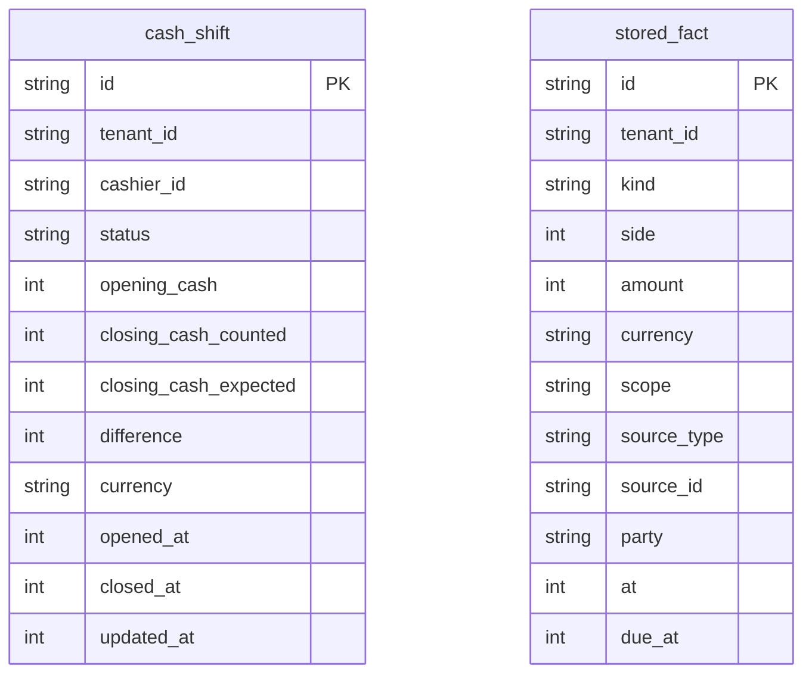

```mermaid
erDiagram
    cash_shift {
        string id PK
        string tenant_id
        string cashier_id
        string status
        int opening_cash
        int closing_cash_counted
        int closing_cash_expected
        int difference
        string currency
        int opened_at
        int closed_at
        int updated_at
    }

    stored_fact {
        string id PK
        string tenant_id
        string kind
        int side
        int amount
        string currency
        string scope
        string source_type
        string source_id
        string party
        int at
        int due_at
    }
```
